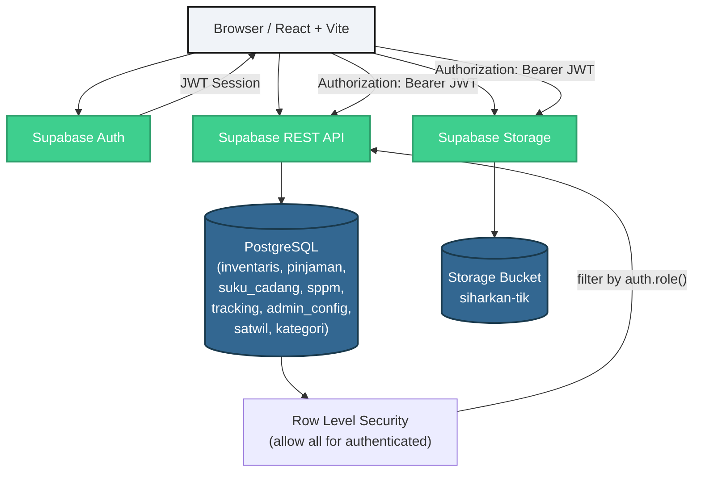
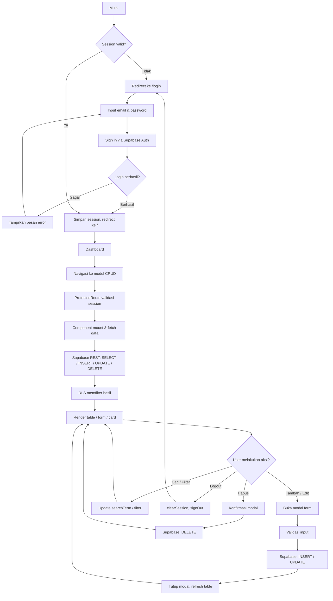
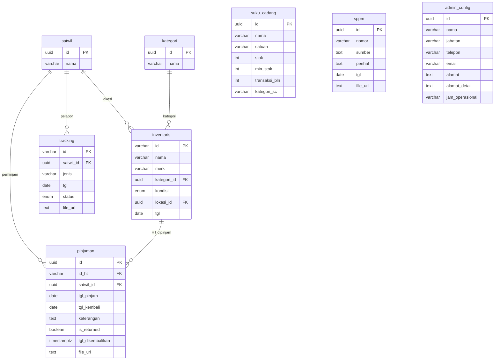

# SIHARKAN TIK

**Sistem Informasi Harmonisasi Peralatan Komunikasi dan Teknologi Informasi — Bidang TIK Polda D.I. Yogyakarta**

SIHARKAN TIK adalah sistem manajemen internal berbasis web untuk mengelola inventaris perangkat TIK, peminjaman HT, suku cadang, dokumen SPPM, dan aduan perbaikan di lingkungan Bidang TIK Polda DIY. Sistem dibangun dengan React + Vite di sisi frontend dan Supabase (Auth, PostgreSQL, Storage) sebagai backend‑as‑a‑service.

> **Status proyek:** Production‑ready. Semua modul CRUD berfungsi dengan Supabase. Formulir login menggunakan Supabase Auth (email/password). Fitur unggah file terintegrasi dengan Supabase Storage.

---

## Fitur Sekilas

- Supabase Authentication (satu akun administrator)
- 7 modul CRUD dengan Supabase PostgreSQL
- Pencarian, filter, dan paginasi di setiap tabel
- Dasbor interaktif dengan statistik dan grafik donat
- Unggah / pratinjau / unduh file pendukung via Supabase Storage
- Ekspor data ke CSV
- Status peminjaman HT dihitung dinamis (Dipinjam / Jatuh Tempo / Terlambat / Dikembalikan)
- Desain responsif (desktop, tablet, ponsel)
- Tema kustom Polri (Navy & Gold)

---

## 📋 Daftar Isi

- [Tentang Sistem](#-tentang-sistem)
- [Fitur Utama](#-fitur-utama)
- [Akses Pengguna](#-akses-pengguna)
- [Arsitektur Sistem](#-arsitektur-sistem)
- [Alur Aplikasi](#-alur-aplikasi)
- [Modul dan Alur Data](#-modul-dan-alur-data)
- [Database](#-database)
- [Keamanan](#-keamanan)
- [Tech Stack](#-tech-stack)
- [Struktur Folder](#-struktur-folder)
- [Menjalankan Project Secara Lokal](#-menjalankan-project-secara-lokal)
- [Konfigurasi Supabase](#-konfigurasi-supabase)
- [Pengujian Fungsional](#-pengujian-fungsional)
- [Build dan Deployment](#-build-dan-deployment)
- [Known Limitations](#-known-limitations--catatan-penting)
- [Roadmap](#-roadmap)
- [Kontribusi](#-kontribusi)
- [Lisensi](#-lisensi)

---

## 📖 Tentang Sistem

### Masalah yang Dipecahkan

Bidang TIK Polda DIY sebelumnya mengelola inventaris perangkat, peminjaman HT, suku cadang, dokumen SPPM, dan aduan perbaikan secara manual atau melalui sistem yang tidak terintegrasi. SIHARKAN TIK menyatukan semua proses tersebut dalam satu platform digital dengan otentikasi terpusat dan akses berbasis peran.

### Ruang Lingkup

- **Inventaris Alat TIK** — pencatatan seluruh perangkat TIK (HT, Tower, Repeater, Ransus, Bodyworn, Command Center, Call Center, Drone)
- **Pinjam Pakai HT** — pengelolaan peminjaman HT ke satwil dengan status dinamis
- **Suku Cadang** — monitoring stok dengan peringatan batas minimum
- **SPPM** — pengelolaan Surat Perintah Pelaksanaan Pekerjaan (Mabes Polri & Polres)
- **Tracking Perbaikan** — pencatatan dan pemantauan aduan perbaikan perangkat
- **Kontak Admin** — informasi kontak administrator yang dapat diedit

### Pengguna

Sistem saat ini menggunakan **satu akun administrator** melalui Supabase Auth. Tidak ada pendaftaran pengguna umum.

---

## ✨ Fitur Utama

| Modul | Fungsi | Status |
|-------|--------|--------|
| **Dashboard** | Ringkasan statistik, grafik donat, akses cepat, aktivitas terbaru, notifikasi stok | ✅ Berfungsi |
| **Login** | Autentikasi email/password via Supabase Auth | ✅ Berfungsi |
| **Logout** | Hapus sesi, redirect ke halaman login | ✅ Berfungsi |
| **Inventaris / Alat TIK** | CRUD inventaris, filter kategori/kondisi/lokasi, pencarian, paginasi, ekspor CSV, ID otomatis | ✅ Berfungsi |
| **Pinjaman HT** | CRUD peminjaman, status dinamis (Dipinjam/Jatuh Tempo/Terlambat/Dikembalikan), tandai kembali, unggah file, pratinjau file | ✅ Berfungsi |
| **Suku Cadang** | CRUD suku cadang, monitoring stok menipis/aman, statistik, ekspor CSV | ✅ Berfungsi |
| **SPPM** | CRUD SPPM, dua tab (Mabes/Polres), unggah file, pratinjau, unduh, ekspor CSV | ✅ Berfungsi |
| **Tracking Perbaikan** | CRUD aduan, filter status/layanan, pencarian, unggah file, ekspor CSV | ✅ Berfungsi |
| **Kontak Admin** | Tampilkan/edit informasi kontak administrator, simpan ke Supabase | ✅ Berfungsi |
| **Pencarian** | Pencarian teks multi-kolom (case‑insensitive) | ✅ Berfungsi |
| **Filter** | Filter dropdown per status/kategori/lokasi | ✅ Berfungsi |
| **Paginasi** | Paginasi 10 item per halaman dengan navigasi halaman | ✅ Berfungsi |
| **Unggah File** | Upload file pendukung (PDF/JPG/PNG) ke Supabase Storage | ✅ Berfungsi (Pinjaman HT, SPPM, Tracking) |
| **Ekspor CSV** | Unduh data tabel sebagai file CSV dengan BOM UTF‑8 | ✅ Berfungsi |

---

## 👤 Akses Pengguna

- Sistem menggunakan **Supabase Authentication** dengan provider **Email / Password**.
- Hanya terdapat **satu akun administrator** yang dikelola manual melalui Supabase Dashboard.
- **Tidak ada halaman pendaftaran umum.** Pengguna baru hanya dapat ditambahkan oleh pengelola database di Supabase Auth.
- Setiap route (kecuali `/login`) dilindungi oleh komponen `ProtectedRoute` — mengarahkan ke `/login` jika sesi tidak aktif.
- Sesi dikelola melalui `autoRefreshToken` dan `persistSession`.

> **Jangan menyimpan kredensial login di kode sumber atau README.**

---

## 🏗️ Arsitektur Sistem



### Komponen Arsitektur

| Komponen | Teknologi | Peran |
|----------|-----------|-------|
| **Frontend** | React 18 + Vite 5 | UI, routing, state management, komunikasi Supabase |
| **Autentikasi** | Supabase Auth (GoTrue) | Login email/password, manajemen sesi JWT |
| **Database** | Supabase PostgreSQL 15 | Penyimpanan data utama dengan RLS |
| **Storage** | Supabase Storage | Penyimpanan file pendukung (PDF, gambar) |
| **Keamanan** | Row Level Security (RLS) | Pembatasan akses data per role |
| **Routing** | React Router DOM 6 | Navigasi klien dengan protected route |

---

## 🔄 Alur Aplikasi



---

## 🧩 Modul dan Alur Data

### Dashboard

Menampilkan ringkasan dari seluruh modul. Data statistik dikomputasi dari semua service.

**Statistik:** total inventaris per kategori, kondisi HT, status tracking (Belum Ditindaklanjuti / Proses / Selesai), peminjaman HT aktif, stok suku cadang menipis.

**Grafik:** donut chart kondisi inventaris.

**Akses Cepat:** tautan navigasi ke halaman tambah data.

### Inventaris / Alat TIK

| Kolom Database | Tipe |
|---|---|
| `id` | VARCHAR(20) PK |
| `nama`, `merk` | VARCHAR |
| `kategori_id` → kategori(id) | UUID |
| `kondisi` | ENUM (Baik, Rusak Ringan, Rusak Berat) |
| `lokasi_id` → satwil(id) | UUID |
| `tgl` | DATE |

**Aksi:** tambah, edit, hapus, ekspor CSV. ID dihasilkan otomatis dengan prefix kategori (HT‑, TWR‑, RPT‑, dll).

### Pinjaman HT

| Kolom Database | Tipe |
|---|---|
| `id` | UUID PK |
| `id_ht` → inventaris(id) | VARCHAR(20) |
| `satwil_id` → satwil(id) | UUID |
| `tgl_pinjam`, `tgl_kembali` | DATE |
| `keterangan` | TEXT |
| `is_returned` | BOOLEAN |
| `tgl_dikembalikan` | TIMESTAMPTZ |
| `file_url` | TEXT |

**Status dihitung dinamis:**
- `is_returned = true` → **Dikembalikan**
- `tgl_kembali < hari ini` → **Terlambat**
- `tgl_kembali 0–2 hari` → **Jatuh Tempo**
- selainnya → **Dipinjam**

**Aksi:** tambah, edit, hapus, tandai dikembalikan, unggah file, pratinjau file, ekspor CSV.

### Suku Cadang

| Kolom Database | Tipe |
|---|---|
| `id` | UUID PK |
| `nama`, `satuan` | VARCHAR |
| `stok`, `min_stok`, `transaksi_bln` | INTEGER |
| `kategori_sc` | VARCHAR |

**Peringatan otomatis** ketika `stok < min_stok`.

### SPPM

| Kolom Database | Tipe |
|---|---|
| `id` | UUID PK |
| `nomor` | VARCHAR UNIQUE |
| `sumber` | TEXT CHECK (Mabes Polri / Polres) |
| `perihal` | TEXT |
| `tgl` | DATE |
| `file_url` | TEXT |

**Dua tab:** Mabes Polri dan Polres. Unggah file khusus PDF/JPG/PNG.

### Tracking Perbaikan

| Kolom Database | Tipe |
|---|---|
| `id` | VARCHAR(20) PK |
| `satwil_id` → satwil(id) | UUID |
| `jenis` | VARCHAR |
| `tgl` | DATE |
| `status` | ENUM (Belum Ditindaklanjuti, Proses, Selesai) |
| `file_url` | TEXT |

**ID otomatis:** `ADU‑001`, `ADU‑002`, …

### Kontak Admin

| Kolom Database | Tipe |
|---|---|
| `id` | UUID PK |
| `nama`, `jabatan`, `telepon`, `email`, `alamat`, dll | VARCHAR |

Data ditampilkan di kartu kontak. Panel pengaturan memungkinkan edit langsung.

---

## 🗃️ Database

### Entity Relationship



### Tabel Database

| Tabel | Tipe PK | Catatan |
|-------|---------|---------|
| `satwil` | UUID | Referensi satuan wilayah (6 row seed) |
| `kategori` | UUID | Referensi kategori alat (8 row seed) |
| `inventaris` | VARCHAR(20) | ID dengan prefix: HT‑, TWR‑, RPT‑, dll |
| `pinjaman` | UUID | Status dihitung dinamis via `is_returned` + `tgl_kembali` |
| `suku_cadang` | UUID | Kolom `stok_awal` ditambahkan via migrasi manual |
| `tracking` | VARCHAR(20) | ID format `ADU‑XXX` |
| `sppm` | UUID | Field `sumber` dibatasi: Mabes Polri / Polres |
| `admin_config` | UUID | Hanya 1 row; menyimpan kontak administrator |

### Row Level Security

Semua tabel memiliki RLS diaktifkan. Migrasi `00003_hotfix_rls_anon.sql` menetapkan kebijakan `USING (true)` (allow all) untuk semua operasi karena aplikasi menggunakan kustom login yang membuat `auth.role()` selalu `anon`.

---

## 🔐 Keamanan

### Praktik yang Diterapkan

| Praktik | Status |
|---------|--------|
| Autentikasi via Supabase Auth (email/password) | ✅ |
| Route protection dengan `ProtectedRoute` | ✅ |
| Sesi JWT dikelola dengan `autoRefreshToken` + `persistSession` | ✅ |
| Halaman login menerjemahkan pesan error tanpa membocorkan detail teknis | ✅ |
| `.env` tidak masuk version control | ✅ |
| Kredensial tidak di-hardcode di kode sumber | ✅ |

### Checklist Keamanan

- [x] Tidak ada kredensial di kode sumber
- [x] Environment variables untuk URL dan kunci Supabase
- [x] Protected routes memvalidasi sesi sebelum render konten
- [x] Sesi di-refresh otomatis
- [x] Logout menghapus sesi di sisi klien
- [ ] **RLS membutuhkan reviu keamanan** — migrasi `00003` menetapkan `USING (true)` untuk seluruh tabel. Untuk production sejati, kebijakan RLS harus diperketat kembali menjadi `auth.role() = 'authenticated'`.
- [ ] **Kunci publishable key (anon)** terekspos di kode frontend — ini adalah desain arsitektur Supabase, RLS adalah lapisan keamanan yang seharusnya membatasi akses meskipun kunci publik bocor. Namun karena RLS saat ini `USING (true)`, database praktiknya terbuka untuk siapa pun yang memiliki kunci anon. Lihat [Known Limitations](#-known-limitations--catatan-penting).

---

## 🛠️ Tech Stack

| Layer | Teknologi | Kegunaan |
|-------|-----------|----------|
| **UI Library** | React 18.2.0 | Komponen antarmuka |
| **Build Tool** | Vite 5.x | Development server, bundling |
| **Routing** | React Router DOM 6.20.0 | Navigasi klien, protected routes |
| **Backend as a Service** | Supabase | Autentikasi, PostgreSQL, Storage |
| **Supabase Client** | `@supabase/supabase-js` 2.108+ | SDK untuk akses Auth, REST, Storage |
| **Linting** | ESLint 9.x | Kualitas kode |
| **CSS** | Custom (vanilla CSS) | Design system Polri + responsive |

---

## 📁 Struktur Folder

```text
siharkan-tik-web/
├── public/
│   ├── favicon.svg
│   └── icons.svg
├── src/
│   ├── assets/              # Gambar statis (logo)
│   ├── components/
│   │   ├── layout/          # Sidebar, Topbar, ProtectedRoute
│   │   └── ui/              # Badge, Button, Card, Modal, Table, dll
│   ├── contexts/            # AuthContext (sesi & login)
│   ├── hooks/               # useSearch, usePagination, useToast, useExport
│   ├── layouts/             # MainLayout (sidebar + topbar + outlet)
│   ├── lib/                 # Inisialisasi Supabase client
│   ├── pages/               # 8 halaman aplikasi
│   ├── routes/              # Konfigurasi route dengan React.lazy()
│   ├── services/            # Tiap modul punya service file terpisah
│   ├── utils/               # exportToCSV, format tanggal
│   ├── App.css              # Design system lengkap (~800 baris)
│   ├── App.jsx              # Root component
│   └── main.jsx             # Entry point
├── supabase/
│   └── migrations/          # 4 file migrasi SQL
├── .env                     # Environment variables (tidak dikomit)
├── .env.example             # Template env
├── package.json
├── vite.config.js
└── README.md
```

### Peran Direktori `src/`

| Direktori | Tanggung Jawab |
|-----------|----------------|
| `components/layout/` | Shell aplikasi: sidebar navigasi, topbar, wrapper protected route |
| `components/ui/` | Komponen UI reusable (modal, tabel, badge, button, pagination, dll) — 14 file |
| `contexts/` | `AuthContext` — menyediakan session, loading, refreshSession, clearSession ke seluruh app |
| `hooks/` | Custom hooks: pencarian, paginasi, toast, ekspor CSV |
| `layouts/` | `MainLayout` — layout utama setelah login: sidebar + topbar + `<Outlet />` |
| `lib/` | Inisialisasi Supabase client — membaca env `VITE_SUPABASE_URL` dan `VITE_SUPABASE_PUBLISHABLE_KEY` |
| `pages/` | 8 halaman: LoginPage + 7 protected pages |
| `routes/` | `AppRoutes` — lazy loading, error boundary, protected route wrapper |
| `services/` | 10 file service: tiap file mengelola akses ke satu tabel Supabase + storage + auth |
| `utils/` | Fungsi utilitas: `exportToCSV()`, `formatTanggal()`, `formatSatuan()` |

---

## 🚀 Menjalankan Project Secara Lokal

### Prasyarat

- Node.js 18+ dan npm
- Akses ke proyek Supabase (URL + publishable key)

### Langkah

```bash
# 1. Clone atau buka direktori project
cd siharkan-tik-web

# 2. Install dependencies
npm install

# 3. Buat file .env dari template
cp .env.example .env
#   Edit .env: isi VITE_SUPABASE_URL dan VITE_SUPABASE_PUBLISHABLE_KEY

# 4. Jalankan development server
npm run dev
#   Server berjalan di http://localhost:5173

# 5. Build untuk production
npm run build
#   Output di folder dist/

# 6. Preview build production
npm run preview
```

### Environment Variables

Berkas `.env.example`:

```env
VITE_SUPABASE_URL=https://your-project.supabase.co
VITE_SUPABASE_PUBLISHABLE_KEY=your_publishable_key
```

| Variabel | Deskripsi |
|----------|-----------|
| `VITE_SUPABASE_URL` | URL endpoint Supabase project |
| `VITE_SUPABASE_PUBLISHABLE_KEY` | Kunci anon/publik dari Supabase dashboard |

> **Peringatan:** Jangan pernah commit `.env` yang berisi kunci nyata ke repository.

---

## ⚙️ Konfigurasi Supabase

### 1. Buat Proyek Supabase

Buka [supabase.com](https://supabase.com), buat proyek baru.

### 2. Jalankan Migrasi

Buka **SQL Editor** di Supabase Dashboard, jalankan file migrasi dari `supabase/migrations/` secara berurutan:

- `00001_initial_schema_fixed.sql` atau `00001_initial_schema.sql`
- `00002_rls_and_storage.sql`
- `00003_hotfix_rls_anon.sql`

Migrasi akan membuat tabel, relasi, seed data, bucket storage, dan kebijakan RLS.

### 3. Buat Pengguna Auth

- Buka **Authentication → Users** di Supabase Dashboard
- Klik **Add User**
- Masukkan email dan password untuk akun administrator
- **Pastikan** untuk mengonfirmasi email pengguna (atau nonaktifkan confirm email di Auth settings)

> Atau gunakan panel Settings → Configuration → Provider → Email — nonaktifkan **Confirm email** untuk memudahkan pengujian.

### 4. Verifikasi RLS

Periksa kebijakan RLS di **Authentication → Policies**. Migrasi `00003` menetapkan `USING (true)` untuk semua tabel. Jika diperlukan pengamanan lebih ketat, ubah setiap policy menjadi:

```sql
CREATE POLICY "Allow authenticated full access" ON nama_tabel
  FOR ALL USING (auth.role() = 'authenticated');
```

### 5. Konfigurasi Storage (Opsional)

Bucket `siharkan-tik` dibuat otomatis oleh migrasi `00002`. Verifikasi di **Storage → Buckets**.

### 6. Tambah Environment Variables

Salin `.env.example` ke `.env`, isi dengan `VITE_SUPABASE_URL` dan `VITE_SUPABASE_PUBLISHABLE_KEY` dari **Project Settings → API**.

### 7. Restart Vite

Setelah mengubah `.env`, restart development server.

---

## 🧪 Pengujian Fungsional

### Login dan Autentikasi

- [x] Login dengan email dan password yang valid → redirect ke Dashboard
- [x] Login dengan kredensial salah → pesan error dalam Bahasa Indonesia
- [x] Akses route `/` tanpa sesi → redirect ke `/login`
- [x] Klik logout → sesi dihapus, redirect ke `/login`
- [x] Setelah logout, akses route manapun → redirect ke `/login`

### Dashboard

- [x] Statistik inventaris, pinjaman, suku cadang, tracking muncul
- [x] Grafik donut kondisi inventaris tampil
- [x] Quick Access links berfungsi
- [x] Aktivitas terbaru tampil

### Inventaris / Alat TIK

- [x] Tabel memuat data dari Supabase
- [x] Tambah data via modal → data muncul di tabel
- [x] Edit data via modal → perubahan tersimpan
- [x] Hapus data dengan konfirmasi → data hilang
- [x] Pencarian berdasarkan nama, merk, lokasi
- [x] Filter dropdown (kategori, kondisi, lokasi)
- [x] Paginasi (10 item per halaman)
- [x] Ekspor CSV berfungsi

### Pinjaman HT

- [ ] CRUD berfungsi
- [ ] Status otomatis (Dipinjam / Jatuh Tempo / Terlambat / Dikembalikan)
- [ ] Tombol "Kembalikan" mengubah status
- [x] Unggah file pendukung → file muncul di Supabase Storage
- [x] Pratinjau file via modal
- [x] Ekspor CSV berfungsi

### Suku Cadang

- [x] CRUD berfungsi
- [x] Kartu statistik (Total, Menipis, Aman, Transaksi)
- [x] Peringatan stok menipis (stok < min_stok)
- [x] Ekspor CSV berfungsi

### SPPM

- [x] CRUD berfungsi
- [x] Dua tab (Mabes Polri / Polres)
- [x] Unggah file → file muncul di Supabase Storage
- [x] Pratinjau file via modal
- [x] Unduh file (force download via fetch + blob)
- [x] Ekspor CSV berfungsi

### Tracking Perbaikan

- [x] CRUD berfungsi
- [x] ID otomatis (ADU‑XXX)
- [x] Filter status dan jenis layanan
- [x] Pencarian
- [x] Paginasi
- [x] Unggah file
- [x] Ekspor CSV berfungsi

### Kontak Admin

- [x] Informasi kontak tampil dari Supabase
- [x] Panel pengaturan dapat diedit dan disimpan
- [x] Perubahan langsung tampil di kartu kontak

### Responsive UI

- [x] Desktop (> 900px): sidebar tetap, navigasi penuh
- [x] Tablet (600–900px): sidebar overlay, brand tampil
- [x] Ponsel (< 600px): sidebar overlay, breadcrumb sembunyi, user‑chip sederhana
- [x] Tabel dapat di-scroll horizontal di layar sempit

---

## 📦 Build dan Deployment

### Production Build

```bash
npm run build
```

Output: folder `dist/` — siap di‑hosting di static web server mana pun.

### Deployment Guide

Tidak ada konfigurasi deployment spesifik di dalam proyek saat ini (tidak ada file `vercel.json`, `Dockerfile`, atau konfigurasi platform lain). Untuk mendeploy:

1. **Build** project: `npm run build`
2. **Upload** folder `dist/` ke hosting statis (Vercel, Netlify, Firebase Hosting, atau web server)
3. **Set environment variables** di platform hosting:
   - `VITE_SUPABASE_URL`
   - `VITE_SUPABASE_PUBLISHABLE_KEY`
4. **Konfigurasi redirect** untuk SPA (semua route selain file statis diarahkan ke `index.html`)

> Jika menggunakan Vercel, buat file `vercel.json`:
> ```json
> { "rewrites": [{ "source": "/(.*)", "destination": "/index.html" }] }
> ```

---

## ⚠️ Known Limitations / Catatan Penting

### Keamanan

1. **RLS menggunakan `USING (true)`** — migrasi `00003_hotfix_rls_anon.sql` menetapkan kebijakan allow‑all karena `auth.role()` selalu `anon` di lingkungan saat ini. Database pada praktiknya tidak memiliki proteksi RLS. Untuk production, implementasi autentikasi perlu disesuaikan sehingga `auth.role()` mengembalikan `authenticated`, lalu kebijakan RLS diperketat.

2. **Satu akun administrator** — tidak ada sistem role atau multi‑user. Setiap pengguna baru harus ditambahkan manual di Supabase Dashboard.

### Fungsional

3. **Form "Kirim Pesan" di halaman Kontak Admin** — masih berupa form statis tanpa handler submit. Belum ada integrasi pengiriman pesan (email atau database).

4. **Uji coba status Pinjaman HT** — perhitungan status dinamis (Dipinjam / Jatuh Tempo / Terlambat / Dikembalikan) perlu diuji dengan data tanggal yang bervariasi.

### Dokumentasi

5. **Belum ada lisensi resmi** — lihat bagian [Lisensi](#-lisensi).

---

## 🗺️ Roadmap

### Jangka Pendek

- [ ] Perketat RLS: `auth.role() = 'authenticated'`
- [ ] Verifikasi acceptance test untuk seluruh modul
- [ ] Tambah animasi transisi halaman

### Security Hardening

- [ ] Audit kebijakan RLS untuk seluruh tabel
- [ ] Implementasi role‑based access control jika multi‑pengguna dibutuhkan
- [ ] Gunakan Supabase Edge Function untuk operasi yang membutuhkan service_role key

### Enhancement

- [ ] Kirim pesan dari halaman Kontak Admin (simpan ke tabel `messages` atau kirim email via Edge Function)
- [ ] Dashboard real‑time dengan Supabase Realtime subscriptions
- [ ] Ekspor PDF / Excel
- [ ] Riwayat audit log

---

## 🤝 Kontribusi

1. Buat branch dari `main` untuk setiap perubahan
2. Pastikan tidak ada kredensial atau secrets yang tercantum di kode
3. Jalankan `npm run build` sebelum pull request
4. Jika mengubah struktur database, buat file migrasi baru di `supabase/migrations/`
5. Update README jika menambah atau mengubah fitur

---

## 📄 Lisensi

Belum ditentukan.

---

*Dokumentasi ini sesuai dengan kode sumber per tanggal **5 Juli 2026**.*
